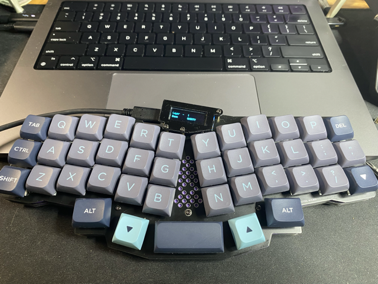
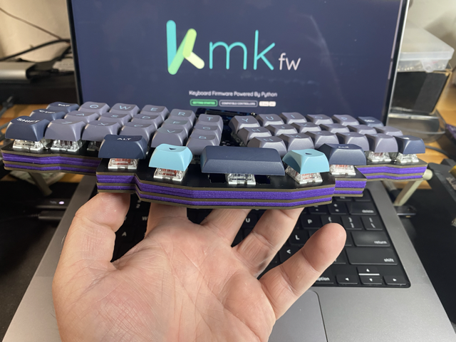
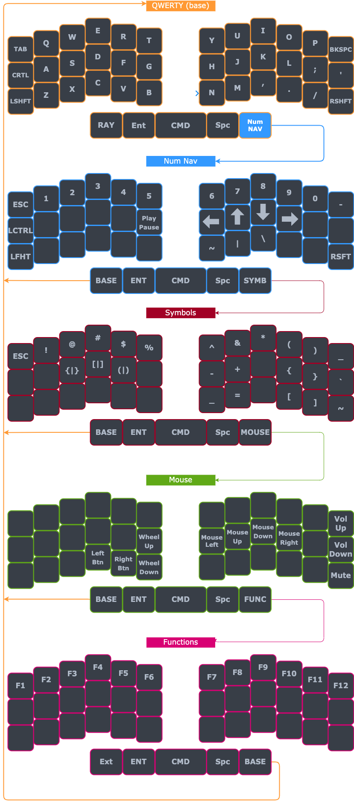
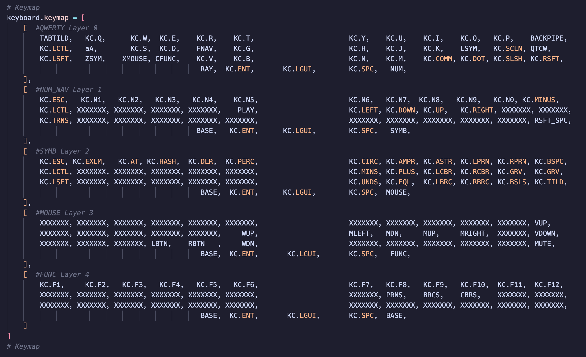

# Reviung41

The Reviung41 is a 41 key keyboard designed by gtips, it is a slightly larger version of the popular Reviung 39. These "split non-split" keyboards offer a lot of features split keyboards have in terms of comfort and ergonomics but do so in a single-piece package. Many people consider keyboards in this style easier to travel with since you don't have to manage two halves and there is of course no need for a TRRS cable. This board sits somewhere between and Atreus and Corne, and it is extremely comfortable to use.

kb.py is designed to work with the nice!nano

Hardware Availability: [PCB & Case Data](https://github.com/gtips/reviung/tree/master/reviung41)

Retailers (USA)  
[Boardsource](https://boardsource.xyz/store/5f2ef1b52bf5e8714a60f613)  

Extensions enabled by default  
- [Layers](http://kmkfw.io/docs/layers) Need more keys than switches? Use layers.
- [ModTap](http://kmkfw.io/docs/modtap) Allows mod keys to act as different keys when tapped.
- [CapsWord](http://kmkfw.io/docs/capsword) Functions similar to caps lock but will deactivate automatically when its encounters a key that breaks the word or after inactivity timeout
- [Combos](http://kmkfw.io/docs/combos) Allow you to assign special functionality to combinations of key presses
- [OneShot](http://kmkfw.io/docs/oneshot) Enable you to have keys that keep staying pressed for a certain time or until another key is pressed and released

Common Extensions
- [Power](/docs/power.md) Powersaving features for battery life

# Keymap graphic

# Keymap python layout

